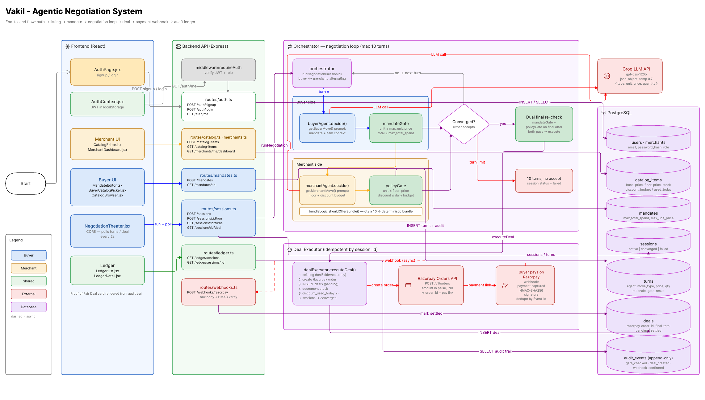

# Vakil - Architecture

**Bounded AI-to-AI Negotiation Commerce**
Razorpay Buildathon · Track 01: AI Growth & Agentic Commerce

## 1. What Vakil Is

Vakil is a two-agent negotiation system: a **Buyer Vakil** representing a
human principal's delegated purchasing authority (a *Mandate*), and a
**Merchant Vakil** representing a seller's inventory and margin rules (a
*negotiation corridor*). The two agents negotiate price, quantity, and
bundles autonomously across multiple turns. Every proposed move is
independently checked against a deterministic policy gate before it is ever
emitted or acted on. Only a deal that clears both gates is sent to Razorpay
for settlement. Every turn is written to an append-only ledger that produces
a **Proof of Fair Deal** - a structured explanation of what was rejected,
what was accepted, and why.

Vakil is not a chatbot in front of a payment API. It is an attempt to answer
the track's harder framing directly: *make the merchant transactable by an
AI buyer end to end* - by building the AI buyer as a first-class, bounded
counterpart, not a proxy for a human typing into a chat window.

## 2. Core Design Principle: Propose → Constrain → Verify

This is the single idea the entire system is built around, and it exists
because of the track's judging bar: *"every money action explainable,
bounded and gated."* An LLM's output cannot, by itself, satisfy that bar -
you cannot prove a bound on what a language model will say. So responsibility
is split cleanly:

- **LLM does judgment** - interpreting an offer, deciding whether to
  concede, drafting a counter-proposal, choosing *which* legal move to make.
- **Deterministic code does enforcement** - what moves are legal at all
  (floor price, mandate cap, inventory, discount budget), and whether money
  actually moves.

Every LLM call returns a structured Move object. That object is never
trusted directly - it is validated against a schema, clamped to the legal
move set, then independently re-checked by a policy gate that has no
knowledge of the LLM's reasoning, only the final numbers. This means an
illegal deal (below floor, over mandate) is structurally impossible to
execute, regardless of what the LLM proposes - provable via unit tests on
the gates, not asserted via careful prompting.

**Merchant Vakil**
- Observes: buyer's latest offer, full turn history, current floor price,
  discount ladder, remaining inventory, remaining daily discount budget.
- Decides: accept, counter, offer a bundle, or walk away.
- Hard constraints: cannot go below floor price; cannot exceed today's
  discount budget; cannot promise stock it doesn't have.
- On invalid/unparseable LLM output: deterministic fallback - hold the
  current offer.
- On policy violation: auto-clamp to the nearest legal offer, logged as
  `adjusted`.

**Buyer Vakil**
- Observes: merchant's latest offer, turn history, remaining Mandate
  budget, category allow-list.
- Decides: accept, counter, reduce quantity, or walk away.
- Hard constraints: cannot commit above `max_total_spend` or
  `max_unit_price`; cannot buy outside allow-listed categories; cannot act
  after `expires_at`.
- On a proposed deal exceeding mandate: blocked by the gate → agent
  autonomously proposes a reduced quantity that fits, before escalating to
  a human.

The LLM is never shown an illegal move as an option - e.g. Merchant Vakil's
prompt never includes a price below floor as something it could offer.
This is deliberate: constraining the *option space* the LLM reasons over is
a second layer of safety on top of the post-hoc gate check.

## 3. Auth and Role Model

Every API route requires a valid JWT. Accounts have one of two roles: `buyer`
or `merchant`. The role is encoded in the token at signup and enforced by
`requireAuth` middleware on every protected route.

- A **buyer** account can create mandates, browse catalog items, and start
  negotiation sessions.
- A **merchant** account has a linked `merchants` row and can create catalog
  items. The merchant's identity is resolved server-side via the token's
  `userId` — the client never sends a `merchant_id` that could be spoofed.

Passwords are bcrypt-hashed (cost factor 12). The login route returns
identical errors for "no such user" and "wrong password" to avoid leaking
account existence.

## 4. UI Architecture

The frontend is role-aware — buyer and merchant users see entirely different
flows from the same codebase, controlled by a `view` state machine in
`App.jsx`.

**Buyer flow:** mandate editor → catalog picker → negotiation theater.
Back navigation exists at every step. A read-only catalog browser is
accessible via the nav at all times. The mandate summary (max unit price,
total budget) is displayed in both the catalog picker and the theater so
constraints are always visible.

**Merchant flow:** defaults to an inventory dashboard showing all listed
items with per-item stats (list price, floor, stock, bundle rules) and
expandable session history with deal counts and revenue. "List new item"
navigates to the catalog editor and returns to the dashboard on completion.

**Proof of Fair Deal card:** the ledger detail view synthesises the turn log
into a plain-language verdict — rounds taken, gate adjustments made, blocked
reason if any, final terms, and the Razorpay order ID — readable at a glance.

## 5. Data Model

Seven core tables plus users, PostgreSQL, relational integrity enforced at the DB layer
(not just in application code) wherever a bound matters:

| Table | Purpose | Key constraints |
|---|---|---|
| `users` | Auth identities (buyer or merchant role) | `UNIQUE(email)` |
| `merchants` | Seller identity, linked to user | `user_id REFERENCES users` |
| `catalog_items` | Inventory + negotiation corridor | `floor_price <= base_price` |
| `mandates` | Buyer's delegated purchasing authority | `spend_used <= max_total_spend` |
| `negotiation_sessions` | One negotiation between one buyer mandate and one catalog item | `status IN (active, converged, failed, expired)` |
| `negotiation_turns` | Append-only turn log | `UNIQUE (session_id, turn_number)` |
| `deals` | Final converged terms + settlement reference | `UNIQUE (session_id)` - one deal per session |
| `audit_events` | Append-only event trail beyond turns (settlement, webhook, adjustments) | - |

`negotiation_turns` and `audit_events` are treated as append-only by
convention in application code, and this is additionally enforced at the
schema level via the `UNIQUE (session_id, turn_number)` constraint - a
retried write can't silently duplicate or overwrite a turn.

`discount_ladder`, `bundle_rules`, `proposed_move`, and `final_terms` are
stored as `JSONB` - these are the genuinely variable-shape parts of the
system (a bundle offer has a different structure than a plain price
counter) and don't need relational structure. Everything that must never be
exceeded (spend caps, floor prices, inventory counts) is a strongly-typed
relational column with a `CHECK` constraint, not buried in JSON.

## 6. Move Schema (Zod)

Every LLM call must return one of two schema-validated shapes. Invalid
output never reaches the gate - it's caught at parse time and replaced with
a deterministic fallback move.

```ts
BuyerMove = {
  type: 'accept' | 'counter' | 'reduce_quantity' | 'walk_away',
  unit_price: number | null,
  quantity: number,
  total: number,
  rationale: string
}

MerchantMove = {
  type: 'accept' | 'counter' | 'bundle' | 'reject',
  unit_price: number | null,
  bundle_items: { item_id: string, quantity: number }[] | null,
  quantity: number,
  rationale: string
}
```

This schema is the single source of truth reused for two jobs: validating
LLM output, and validating API request bodies - so there's no risk of the
two definitions drifting apart.

## 7. AI Layer

- **Provider: Groq** (chosen for zero-cost inference on the free tier and
  low latency, both of which matter more here than raw model sophistication
  - the task is narrow structured decision-making, not open-ended
  reasoning).
- **Model: `openai/gpt-oss-120b`** - Groq's current recommended
  replacement for `llama-3.3-70b-versatile`, which was deprecated by Groq
  on June 17, 2026. Verified against `console.groq.com/docs/models`
  directly before implementation, since Groq's model lineup changes
  frequently.
- **Structured output only** - every call uses `response_format: {type:
  "json_object"}` and the response is validated against the Move schema
  before use.
- **No RAG, no vector DB** - negotiation state is small (current offer,
  short turn history, remaining budget/inventory) and fits directly in the
  prompt context.
- **Known tradeoff:** open models on Groq's free tier are less reliable at
  strict JSON adherence than closed-model structured-output modes. This is
  treated as an expected, tested failure path (deterministic fallback move
  on parse failure) rather than an edge case - it will be exercised
  regularly, not rarely.

## 8. Money Safety Model

**Bounds**
- Merchant: floor price per SKU, max discount %, daily discount budget,
  inventory cap, INR only.
- Buyer: max total spend (Mandate), max unit price, category allow-list,
  Mandate expiry.
- System-wide: a hard demo ceiling regardless of Mandate (safety backstop).

**Gates**
- Automatic: any deal inside both corridors.
- Merchant human approval: single deal above a configurable threshold.
- Buyer human approval: single deal consuming >80% of remaining mandate in
  one session.

**Dual Final Re-check**
Immediately before the Razorpay call, both sides are re-verified against
*live* state (fresh inventory count, fresh mandate remaining) - not the
state from several turns ago. Negotiation and settlement are decoupled in
time, so this catches the case where inventory or mandate validity changed
during the negotiation itself.

**Explainability**
Every turn logs: proposed terms → which rule was checked → pass / blocked /
adjusted → reason. The closing ledger entry states the counterfactual -
e.g. *"Rejected: 1 offer below floor. Accepted: this offer clears 34%
margin and is ₹4,200 inside your mandate."*

## 9. Razorpay Integration

Verified against live Razorpay documentation on Aug 28, 2026 (see
`RAZORPAY_CAPABILITY_MATRIX.md` for full detail). Key facts that shape this
architecture:

- **Orders API** supports a dynamic `amount` at creation (in smallest
  currency subunit - paise for INR), but has **no native idempotency
  header** - deduplication is our responsibility, enforced via the
  `UNIQUE (session_id)` constraint on `deals`.
- **Payment Links API** is fixed-amount only - cannot be reused across
  differently-priced deals. A new order/link is created per negotiated
  session.
- **Webhooks** (`payment.captured`, `order.paid`) confirm settlement.
  Signature verification is HMAC-SHA256 over the **raw, unparsed** request
  body - the webhook route must bypass global JSON body-parsing.
- **Webhook delivery is at-least-once and can arrive out of order** - the
  receiver must be idempotent (via `X-Razorpay-Event-Id`) and must not
  assume `payment.authorized` implies settlement (only `payment.captured`
  does).
- **Test Mode keys** require no KYC and no website verification - usable
  immediately for the full development cycle.

**Idempotency in practice:** before calling Razorpay, the executor checks
whether a `deals` row already exists for `session_id`. If yes, return the
existing order/link rather than creating a new one. This makes a retried
execution (e.g. after a network timeout) provably safe rather than reliant
on hoping the retry logic behaved correctly.

## 10. User Interface & Experience

### Public Landing Page
- **Hero section** explaining bounded AI-to-AI commerce
- **Value propositions:** Provably Bounded, Full Audit Trail, Real Settlement  
- **How It Works** comparison: Buyer Vakil vs Merchant Vakil agents
- **"Get Started" CTA** leads to role-based authentication

### Role-Specific Home Pages

**Buyer Home:**
- Welcome message and quick action cards
- "Start New Negotiation" → mandate editor
- "Browse Catalog" → catalog browser
- 4-step guide: Set Mandate → Agent Negotiates → Gate Verifies → Deal Settles
- Feature highlights: Never Overspends, Smart Adjustment, Full Transparency

**Merchant Home:**
- Welcome message and quick action cards
- "List New Item" → catalog editor  
- "View Dashboard" → inventory and session overview
- 5-step guide: Pricing Corridor → Budget → Negotiates → Gate Enforces → Revenue Captured
- Feature highlights: Never Below Floor, Smart Bundles, Budget Control

### Navigation & Header
- **Top row:** Logo/branding left, user info + sign out right
- **Nav row:** Home | Negotiate/Inventory | Catalog | Ledger
- **Role-aware flows:** buyers see catalog browsing, merchants see dashboard
- Clean hierarchy prevents users from getting lost mid-flow

### Negotiation Theater (centerpiece)
- **Real-time turn display** with agent avatars (buyer in blue, merchant in ochre)
- Each turn shows: move type, price/quantity, rationale, gate result
- **Turn counter** (Turn X/10) provides progress context
- **"Change item" button** available until first turn executes
- **Razorpay order ID** displayed prominently on convergence
- **Proof of Fair Deal card** auto-generated from turn history

### Merchant Dashboard
- **Inventory table** with floor/list pricing, stock levels, discount usage
- **Expandable session rows** showing negotiation status and key metrics
- **Stats summary:** total items, active sessions, converged deals
- **Quick actions:** List new item, view ledger

### Ledger Views
- **List view:** All negotiations with status indicators (converged/failed/active)
- **Detail view:** Full turn-by-turn audit trail with collapsed/expandable turns
- **Proof of Fair Deal section:** Shows both agents satisfied constraints
- **Gate verification indicators:** visual pass/blocked/adjusted states

### Design System
- **Minimalist palette:** Ink (text), Paper (background), Accent (buyer), Ochre (merchant), Rust (errors), Moss (success)
- **Typography:** Display font for headings, mono for data, sans-serif for body
- **Tailwind CSS v4** with CSS variables for consistent theming
- **Mobile-responsive** grid layouts

## 11. Failure Handling (Demoed, Not Just Designed)

1. **Buyer exceeds its own mandate** (primary demo failure) - Buyer
   proposes above `max_total_spend` → mandate gate blocks it → agent
   autonomously proposes a reduced quantity that fits → renegotiates →
   deal closes. Chosen as the headline demo moment because it shows
   bounded autonomy *and* graceful recovery, not just a hard stop.
2. **Inventory race** - another session consumes the last units mid
   negotiation → caught by the dual final re-check before the Razorpay
   call → merchant offers a substitute/bundle instead of silently failing.
3. **Razorpay timeout** - executor retries with backoff; the deal stays
   `pending`, never `failed` outright; retry is idempotent on
   `session_id`, so no duplicate order is ever created.

## 11. Tech Stack

| Layer | Choice | Why |
|---|---|---|
| Frontend | React + Vite + Tailwind CSS v4 | Negotiation Theater is the centerpiece; everything else stays minimal. |
| Backend | Node.js + Express + TypeScript | One deployable service for agents + orchestrator + executor keeps moving parts low for a 9-day build. TypeScript + Zod gives compile-time types inferred directly from runtime-validated schemas. |
| Auth | JWT (jsonwebtoken + bcryptjs) | Stateless, no session store needed. Buyer and merchant roles enforced at the route level via `requireAuth` middleware. |
| Database | PostgreSQL (Neon) | Relational integrity matters - turns, sessions, deals, and audit events all reference each other and have real invariants (a turn belongs to exactly one session, a mandate can't overspend). |
| AI | Groq (`openai/gpt-oss-120b`) | Free tier, low latency, sufficient for narrow structured-output decisions; paired with strict schema validation and deterministic fallback. |
| Payments | Razorpay (test mode) | Orders API + Webhooks, verified against live docs before building against them. |
| Hosting | Vercel (frontend) · Render (backend) · Neon (database) |

## 12. Explicit Non-Goals

Full AP2/ACP protocol compliance, real cryptographic mandate signing/PKI,
multi-currency support, voice interfaces, a general-purpose chat assistant
layered on top for its own sake.

## 13. Stretch (explicitly out of scope for submission)

Multiple concurrent Buyer Vakils competing for limited inventory —
effectively a reverse-auction dynamic on top of the same policy-gate and
ledger infrastructure already built for bilateral negotiation.


---

## 14. System Architecture - Visual Flow

### High-Level System Overview



```
┌─────────────────────────────────────────────────────────────────────────┐
│                         VAKIL SYSTEM ARCHITECTURE                        │
└─────────────────────────────────────────────────────────────────────────┘

┌──────────────┐         ┌──────────────┐         ┌──────────────┐
│   Frontend   │         │   Backend    │         │  PostgreSQL  │
│   (React)    │ ◄─────► │  (Express)   │ ◄─────► │   (Neon)     │
│              │  HTTPS  │              │   SQL   │              │
│  Vite + TW   │         │  TypeScript  │         │  Relational  │
└──────────────┘         └──────────────┘         └──────────────┘
                                │
                                │
                    ┌───────────┴───────────┐
                    │                       │
                    ▼                       ▼
            ┌──────────────┐       ┌──────────────┐
            │   Groq API   │       │  Razorpay    │
            │              │       │              │
            │ Llama 3.3    │       │ Orders API + │
            │ 70B LLM      │       │  Webhooks    │
            └──────────────┘       └──────────────┘
```

---

### Complete End-to-End Negotiation Flow

```
┌─────────────────────────────────────────────────────────────────────────┐
│                    BUYER NEGOTIATION WORKFLOW                            │
└─────────────────────────────────────────────────────────────────────────┘

[1] USER AUTHENTICATION
    │
    ├─► POST /auth/signup { email, password, role: 'buyer' }
    │        │
    │        └──► INSERT INTO users, Generate JWT token
    │                  │
    │                  └──► Response: { token, user }
    │
    └─► Frontend: Store token in localStorage
             │
             └──► Navigate to BuyerHome.jsx

[2] CREATE MANDATE
    │
    ├─► MandateEditor.tsx
    │        │
    │        └──► POST /mandates
    │                  Body: {
    │                    max_total_spend: 5000,
    │                    max_unit_price: 120
    │                  }
    │                       │
    │                       └──► INSERT INTO mandates
    │                                 │
    │                                 └──► Response: { id: mandate_abc }
    │
    └─► Frontend: Store mandateId, navigate to catalog picker

[3] BROWSE & SELECT ITEM
    │
    ├─► BuyerCatalogPicker.jsx
    │        │
    │        └──► GET /catalog-items
    │                  │
    │                  └──► SELECT * FROM catalog_items WHERE stock > 0
    │                            │
    │                            └──► Response: [
    │                                   {
    │                                     id: 'item_xyz',
    │                                     item_name: 'Laptop',
    │                                     base_price: 1500,
    │                                     floor_price: 1000
    │                                   }
    │                                 ]
    │
    └─► User clicks "Negotiate" on an item

[4] CREATE SESSION
    │
    ├─► NegotiationTheater.jsx (useEffect on mount)
    │        │
    │        └──► POST /sessions
    │                  Body: {
    │                    buyer_id,
    │                    mandate_id: 'mandate_abc',
    │                    catalog_item_id: 'item_xyz',
    │                    initial_quantity: 10
    │                  }
    │                       │
    │                       └──► INSERT INTO sessions (status: 'active')
    │                                 │
    │                                 └──► Response: {
    │                                        id: 'session_123',
    │                                        status: 'active'
    │                                      }
    │
    └─► Frontend: Display "Start negotiation" button

[5] RUN NEGOTIATION (THE CORE)
    │
    ├─► User clicks "Start negotiation"
    │        │
    │        └──► POST /sessions/session_123/run
    │                  │
    │                  └──► orchestrator.runNegotiation(session_123)
    │                            │
    │                            └──► [See detailed orchestrator flow below]
    │
    └─► Frontend: Poll GET /sessions/session_123/turns every 2 seconds

[6] VIEW RESULTS
    │
    ├─► GET /sessions/session_123/deal
    │        │
    │        └──► SELECT * FROM deals WHERE session_id = 'session_123'
    │                  │
    │                  └──► Response: {
    │                         razorpay_order_id: 'order_K7h3h4h5',
    │                         final_unit_price: 1100,
    │                         final_quantity: 10,
    │                         status: 'pending'
    │                       }
    │
    └─► Frontend: Display Razorpay order ID + Proof of Fair Deal card
```

---

### Orchestrator - The Negotiation Engine

```
┌─────────────────────────────────────────────────────────────────────────┐
│                  ORCHESTRATOR: runNegotiation(session_id)                │
│                         (Up to 10 turns max)                             │
└─────────────────────────────────────────────────────────────────────────┘

START
  │
  ├─► Load session data from database
  │     - mandate (buyer constraints)
  │     - catalog_item (merchant pricing corridor)
  │     - initial_quantity
  │
  ├─► Initialize: turnCount = 0, currentOffer = null
  │
  └─► BEGIN TURN LOOP
        │
        ┌───────────────────────────────────────────────────┐
        │              TURN N (N = 1 to 10)                 │
        └───────────────────────────────────────────────────┘
        │
        ├─► [A] BUYER AGENT DECIDES
        │     │
        │     ├─► Context:
        │     │     - mandate: { max_total_spend, max_unit_price }
        │     │     - catalog_item: { base_price, item_name }
        │     │     - merchant's last offer (if exists)
        │     │     - turn history
        │     │
        │     ├─► groqClient.getBuyerMove(context)
        │     │     │
        │     │     └─► POST https://api.groq.com/openai/v1/chat/completions
        │     │           Body: {
        │     │             model: "llama-3.3-70b-versatile",
        │     │             messages: [
        │     │               {
        │     │                 role: "system",
        │     │                 content: "You are a buyer agent.
        │     │                          Your mandate: max ₹5000 total, ₹120/unit max.
        │     │                          Negotiate the best deal within bounds.
        │     │                          Never exceed your mandate.
        │     │                          All prices in INR (₹)."
        │     │               },
        │     │               {
        │     │                 role: "user",
        │     │                 content: "Merchant offered ₹110/unit for 10.
        │     │                          Respond with JSON only."
        │     │               }
        │     │             ],
        │     │             response_format: { type: "json_object" }
        │     │           }
        │     │                │
        │     │                └─► Response: {
        │     │                      choices: [{
        │     │                        message: {
        │     │                          content: '{
        │     │                            "type": "counter",
        │     │                            "unit_price": 105,
        │     │                            "quantity": 10,
        │     │                            "rationale": "Can go up to ₹105..."
        │     │                          }'
        │     │                        }
        │     │                      }]
        │     │                    }
        │     │
        │     ├─► Parse LLM response → buyerMove
        │     │
        │     ├─► mandateGate.checkMandate(buyerMove, mandate)
        │     │     │
        │     │     ├─► Check: unit_price <= max_unit_price?
        │     │     │     - 105 <= 120? ✓ PASS
        │     │     │
        │     │     ├─► Check: unit_price * quantity <= max_total_spend?
        │     │     │     - 105 * 10 = 1050 <= 5000? ✓ PASS
        │     │     │
        │     │     └─► If violation detected:
        │     │           - Adjust quantity to fit budget
        │     │           - Return: { result: 'adjusted', adjustedQuantity }
        │     │
        │     │     Result: { result: 'pass' }
        │     │
        │     ├─► INSERT INTO turns
        │     │     (session_id, agent: 'buyer', move_type: 'counter',
        │     │      unit_price: 105, quantity: 10,
        │     │      rationale: "Can go up to ₹105...",
        │     │      gate_result: 'pass')
        │     │
        │     ├─► INSERT INTO audit_events
        │     │     (session_id, event_type: 'gate_checked',
        │     │      details: { agent: 'buyer', result: 'pass' })
        │     │
        │     ├─► Update currentOffer = buyerMove
        │     │
        │     └─► Check convergence: buyerMove.type == 'accept'?
        │           - No, continue to merchant turn
        │
        ├─► [B] MERCHANT AGENT DECIDES
        │     │
        │     ├─► Context:
        │     │     - policy: { floor_price, base_price, discount_budget }
        │     │     - buyer's offer: { unit_price: 105, quantity: 10 }
        │     │     - turn history
        │     │
        │     ├─► Check if bundle should be offered:
        │     │     bundleLogic.shouldOfferBundle(quantity: 10)
        │     │       - quantity >= 10? ✓ YES
        │     │       - bundle not declined yet? ✓ YES
        │     │       └─► Inject deterministic bundle:
        │     │             {
        │     │               type: 'bundle',
        │     │               bundle_items: [{ item_id, quantity: 15 }],
        │     │               unit_price: 100,  // 10% discount
        │     │               rationale: "Better rate at higher volume"
        │     │             }
        │     │
        │     ├─► (If no bundle) groqClient.getMerchantMove(context)
        │     │     │
        │     │     └─► POST https://api.groq.com/openai/v1/chat/completions
        │     │           Body: {
        │     │             model: "llama-3.3-70b-versatile",
        │     │             messages: [
        │     │               {
        │     │                 role: "system",
        │     │                 content: "You are a merchant agent.
        │     │                          Your floor: ₹1000/unit (never go below).
        │     │                          Your list: ₹1500/unit.
        │     │                          Negotiate but hold firm near list price.
        │     │                          All prices in INR (₹)."
        │     │               },
        │     │               {
        │     │                 role: "user",
        │     │                 content: "Buyer offered ₹105/unit for 10.
        │     │                          Respond with JSON only."
        │     │               }
        │     │             ]
        │     │           }
        │     │                │
        │     │                └─► Response: {
        │     │                      content: '{
        │     │                        "type": "counter",
        │     │                        "unit_price": 110,
        │     │                        "quantity": 10,
        │     │                        "rationale": "Can meet at ₹110..."
        │     │                      }'
        │     │                    }
        │     │
        │     ├─► Parse LLM response → merchantMove
        │     │
        │     ├─► policyGate.checkPolicy(merchantMove, policy)
        │     │     │
        │     │     ├─► Check: unit_price >= floor_price?
        │     │     │     - 110 >= 100? ✓ PASS
        │     │     │
        │     │     ├─► Check: discount within daily budget?
        │     │     │     - (base_price - unit_price) * qty <= budget?
        │     │     │     - (150 - 110) * 10 = 400 <= 5000? ✓ PASS
        │     │     │
        │     │     └─► If violation detected:
        │     │           - Adjust price to floor
        │     │           - Return: { result: 'adjusted', adjustedPrice }
        │     │
        │     │     Result: { result: 'pass' }
        │     │
        │     ├─► INSERT INTO turns
        │     │     (session_id, agent: 'merchant', move_type: 'counter',
        │     │      unit_price: 110, quantity: 10,
        │     │      rationale: "Can meet at ₹110...",
        │     │      gate_result: 'pass')
        │     │
        │     ├─► INSERT INTO audit_events
        │     │     (session_id, event_type: 'gate_checked',
        │     │      details: { agent: 'merchant', result: 'pass' })
        │     │
        │     ├─► Update currentOffer = merchantMove
        │     │
        │     └─► Check convergence: merchantMove.type == 'accept'?
        │           - No, increment turnCount
        │
        ├─► turnCount++
        │
        └─► Loop condition: turnCount < 10 AND not converged
              │
              ├─► Continue to next turn
              │
              └─► (After 10 turns) FAILED - no agreement reached

        ┌───────────────────────────────────────────────────┐
        │            CONVERGENCE DETECTED                    │
        │  (Either agent accepted the other's offer)        │
        └───────────────────────────────────────────────────┘
        │
        ├─► [C] DUAL FINAL RE-CHECK
        │     │
        │     ├─► mandateGate.checkMandate(currentOffer, mandate)
        │     │     - Verify buyer constraints still satisfied
        │     │     - Even if merchant adjusted via policy gate
        │     │
        │     └─► policyGate.checkPolicy(currentOffer, policy)
        │           - Verify merchant constraints still satisfied
        │           - Ensure no race conditions with inventory
        │
        ├─► [D] EXECUTE DEAL
        │     │
        │     └─► dealExecutor.executeDeal(session_id, currentOffer)
        │           │
        │           ├─► Check for existing deal (idempotency):
        │           │     SELECT * FROM deals WHERE session_id = ?
        │           │     - If exists: return existing deal
        │           │     - If not: proceed
        │           │
        │           ├─► Create Razorpay Order:
        │           │     POST https://api.razorpay.com/v1/orders
        │           │     Headers: { Authorization: "Basic <base64>" }
        │           │     Body: {
        │           │       amount: 110000,  // ₹1100 in paise
        │           │       currency: "INR",
        │           │       receipt: "session_123"
        │           │     }
        │           │          │
        │           │          └─► Response: {
        │           │                id: "order_K7h3h4h5j6k7l8",
        │           │                amount: 110000,
        │           │                currency: "INR",
        │           │                status: "created"
        │           │              }
        │           │
        │           ├─► INSERT INTO deals
        │           │     (session_id, razorpay_order_id: 'order_K7h3h4h5',
        │           │      final_unit_price: 110, final_quantity: 10,
        │           │      final_total: 1100, status: 'pending')
        │           │
        │           ├─► UPDATE catalog_items
        │           │     SET stock = stock - 10,
        │           │         discount_used_today = discount_used_today + 400
        │           │     WHERE id = 'item_xyz'
        │           │
        │           ├─► UPDATE sessions
        │           │     SET status = 'converged'
        │           │     WHERE id = 'session_123'
        │           │
        │           └─► INSERT INTO audit_events
        │                 (session_id, event_type: 'deal_created',
        │                  details: { razorpay_order_id, final_total })
        │
        └─► Response: {
              converged: true,
              turnsUsed: 6,
              dealExecuted: true,
              razorpayOrderId: 'order_K7h3h4h5',
              paymentLink: 'https://razorpay.com/checkout/...'
            }

END
```

---

### Webhook - Payment Confirmation Flow

```
┌─────────────────────────────────────────────────────────────────────────┐
│                    RAZORPAY WEBHOOK FLOW (ASYNC)                         │
└─────────────────────────────────────────────────────────────────────────┘

[1] USER COMPLETES PAYMENT
    │
    └─► Razorpay Checkout UI
          - User pays ₹1100 via UPI/Card
          - Payment captured by Razorpay

[2] RAZORPAY FIRES WEBHOOK
    │
    └─► POST https://your-backend.com/webhooks/razorpay
          Headers: {
            X-Razorpay-Signature: "<HMAC-SHA256 signature>",
            X-Razorpay-Event-Id: "evt_K7h3h4h5j6k7l9"
          }
          Body: {
            event: "payment.captured",
            payload: {
              payment: {
                entity: {
                  order_id: "order_K7h3h4h5j6k7l8",
                  amount: 110000,
                  status: "captured"
                }
              }
            }
          }

[3] BACKEND WEBHOOK HANDLER
    │
    ├─► routes/webhooks.ts (raw body parser, NOT JSON)
    │     │
    │     ├─► [A] VERIFY SIGNATURE
    │     │     │
    │     │     ├─► Compute HMAC-SHA256:
    │     │     │     signature = hmac_sha256(
    │     │     │       secret: RAZORPAY_WEBHOOK_SECRET,
    │     │     │       message: raw_request_body
    │     │     │     )
    │     │     │
    │     │     ├─► Compare with X-Razorpay-Signature header
    │     │     │
    │     │     └─► If mismatch:
    │     │           - Return 400 Bad Request
    │     │           - Do NOT process webhook
    │     │           - Log security alert
    │     │
    │     ├─► [B] DEDUPLICATE
    │     │     │
    │     │     ├─► Check X-Razorpay-Event-Id in memory set
    │     │     │
    │     │     └─► If already processed:
    │     │           - Return 200 OK (idempotent)
    │     │           - Skip processing
    │     │
    │     ├─► [C] EXTRACT ORDER ID
    │     │     │
    │     │     └─► order_id = payload.payment.entity.order_id
    │     │           - "order_K7h3h4h5j6k7l8"
    │     │
    │     ├─► [D] MARK DEAL AS SETTLED
    │     │     │
    │     │     └─► db/deals.markDealSettled(order_id)
    │     │           │
    │     │           ├─► UPDATE deals
    │     │           │     SET status = 'settled',
    │     │           │         webhook_confirmed_at = NOW()
    │     │           │     WHERE razorpay_order_id = 'order_K7h3h4h5'
    │     │           │
    │     │           └─► INSERT INTO audit_events
    │     │                 (deal_id, event_type: 'webhook_confirmed',
    │     │                  details: {
    │     │                    event_id: 'evt_K7h3h4h5j6k7l9',
    │     │                    amount: 1100
    │     │                  })
    │     │
    │     └─► Response: 200 OK
    │
    └─► [E] FRONTEND POLLING DETECTS CHANGE
          │
          └─► GET /sessions/session_123/deal (next poll cycle)
                │
                └─► Response: {
                      razorpay_order_id: 'order_K7h3h4h5',
                      status: 'settled',  ← Changed!
                      webhook_confirmed_at: '2025-09-02T12:34:56Z'
                    }
                      │
                      └─► Frontend: Update UI
                            - Show "✓ Payment Confirmed"
                            - Enable "View Receipt" button
```

---

### Merchant Dashboard Flow

```
┌─────────────────────────────────────────────────────────────────────────┐
│                    MERCHANT DASHBOARD WORKFLOW                           │
└─────────────────────────────────────────────────────────────────────────┘

[1] MERCHANT LOGS IN
    │
    └─► Navigate to MerchantHome.jsx
          - Show quick actions: "List New Item" | "View Dashboard"

[2] VIEW DASHBOARD
    │
    ├─► MerchantDashboard.jsx (on mount)
    │     │
    │     └─► GET /merchants/me/dashboard
    │           Headers: { Authorization: "Bearer <token>" }
    │                │
    │                ├─► [Backend] Get merchant_id from JWT token
    │                │
    │                ├─► Query 1: Get inventory
    │                │     SELECT ci.*,
    │                │            (SELECT COUNT(*) FROM sessions
    │                │             WHERE catalog_item_id = ci.id
    │                │             AND status = 'active') as active_sessions,
    │                │            (SELECT COUNT(*) FROM deals d
    │                │             JOIN sessions s ON d.session_id = s.id
    │                │             WHERE s.catalog_item_id = ci.id) as total_deals
    │                │     FROM catalog_items ci
    │                │     WHERE ci.merchant_id = ?
    │                │
    │                ├─► Query 2: Get recent sessions
    │                │     SELECT s.*, u.display_name as buyer_name,
    │                │            d.final_total, d.status as deal_status
    │                │     FROM sessions s
    │                │     JOIN users u ON s.buyer_id = u.id
    │                │     LEFT JOIN deals d ON s.id = d.session_id
    │                │     WHERE s.catalog_item_id IN (
    │                │       SELECT id FROM catalog_items
    │                │       WHERE merchant_id = ?
    │                │     )
    │                │     ORDER BY s.created_at DESC
    │                │     LIMIT 20
    │                │
    │                └─► Response: {
    │                      inventory: [
    │                        {
    │                          id: 'item_xyz',
    │                          item_name: 'Laptop',
    │                          base_price: 1500,
    │                          floor_price: 1000,
    │                          stock: 90,
    │                          active_sessions: 2,
    │                          total_deals: 5
    │                        }
    │                      ],
    │                      sessions: [
    │                        {
    │                          id: 'session_123',
    │                          status: 'converged',
    │                          buyer_name: 'John Doe',
    │                          final_total: 1100,
    │                          deal_status: 'settled'
    │                        }
    │                      ],
    │                      stats: {
    │                        total_items: 5,
    │                        active_sessions: 3,
    │                        total_revenue: 15000
    │                      }
    │                    }
    │
    └─► Frontend: Display
          - Inventory table with usage stats
          - Expandable session rows
          - Summary stats cards

[3] LIST NEW ITEM
    │
    └─► CatalogEditor.jsx
          │
          └─► POST /catalog-items
                Body: {
                  merchant_id,
                  item_name: "Gaming Mouse",
                  base_price: 80,     // list price (ceiling)
                  floor_price: 50,    // absolute minimum
                  stock: 100,
                  discount_budget_per_day: 2000
                }
                     │
                     └─► INSERT INTO catalog_items
                           │
                           └─► Response: { id: 'item_abc', ... }
                                 │
                                 └─► Navigate back to dashboard
```

---

### Ledger - Audit Trail Flow

```
┌─────────────────────────────────────────────────────────────────────────┐
│                       LEDGER AUDIT TRAIL FLOW                            │
└─────────────────────────────────────────────────────────────────────────┘

[1] VIEW ALL SESSIONS
    │
    ├─► LedgerList.jsx
    │     │
    │     └─► GET /ledger/sessions
    │           Headers: { Authorization: "Bearer <token>" }
    │                │
    │                ├─► [Backend] Check user role from JWT
    │                │
    │                ├─► If buyer:
    │                │     SELECT s.*, ci.item_name, m.display_name as merchant,
    │                │            d.final_total, d.status as deal_status,
    │                │            (SELECT COUNT(*) FROM turns
    │                │             WHERE session_id = s.id) as turn_count
    │                │     FROM sessions s
    │                │     JOIN catalog_items ci ON s.catalog_item_id = ci.id
    │                │     JOIN merchants m ON ci.merchant_id = m.id
    │                │     LEFT JOIN deals d ON s.id = d.session_id
    │                │     WHERE s.buyer_id = ?
    │                │     ORDER BY s.created_at DESC
    │                │
    │                └─► If merchant:
    │                      SELECT s.*, ci.item_name, u.display_name as buyer,
    │                             d.final_total, d.status as deal_status,
    │                             (SELECT COUNT(*) FROM turns
    │                              WHERE session_id = s.id) as turn_count
    │                      FROM sessions s
    │                      JOIN catalog_items ci ON s.catalog_item_id = ci.id
    │                      JOIN users u ON s.buyer_id = u.id
    │                      LEFT JOIN deals d ON s.id = d.session_id
    │                      WHERE ci.merchant_id = ?
    │                      ORDER BY s.created_at DESC
    │
    └─► Frontend: Display list with status badges
          - 🟢 Converged | 🔴 Failed | 🟡 Active

[2] VIEW SESSION DETAIL (Full Audit Trail)
    │
    ├─► User clicks on a session
    │
    └─► LedgerDetail.jsx
          │
          └─► GET /ledger/sessions/session_123
                Headers: { Authorization: "Bearer <token>" }
                     │
                     ├─► Query 1: Get session with full context
                     │     SELECT s.*, ci.*, m.*,
                     │            ma.max_total_spend, ma.max_unit_price,
                     │            d.razorpay_order_id, d.final_total, d.status
                     │     FROM sessions s
                     │     JOIN catalog_items ci ON s.catalog_item_id = ci.id
                     │     JOIN mandates ma ON s.mandate_id = ma.id
                     │     LEFT JOIN deals d ON s.id = d.session_id
                     │     WHERE s.id = ?
                     │
                     ├─► Query 2: Get all turns (negotiation history)
                     │     SELECT *
                     │     FROM turns
                     │     WHERE session_id = 'session_123'
                     │     ORDER BY created_at ASC
                     │
                     └─► Query 3: Get audit events
                           SELECT *
                           FROM audit_events
                           WHERE session_id = 'session_123'
                           ORDER BY created_at ASC
                                │
                                └─► Response: {
                                      session: {
                                        id: 'session_123',
                                        status: 'converged',
                                        catalog_item: {
                                          item_name: 'Laptop',
                                          base_price: 1500,
                                          floor_price: 1000
                                        },
                                        mandate: {
                                          max_total_spend: 5000,
                                          max_unit_price: 120
                                        }
                                      },
                                      turns: [
                                        {
                                          turn_num: 1,
                                          agent: 'buyer',
                                          move_type: 'propose',
                                          unit_price: 100,
                                          quantity: 10,
                                          rationale: "Starting at ₹100/unit...",
                                          gate_result: 'pass',
                                          created_at: '...'
                                        },
                                        {
                                          turn_num: 2,
                                          agent: 'merchant',
                                          move_type: 'counter',
                                          unit_price: 120,
                                          quantity: 10,
                                          rationale: "Can meet at ₹120...",
                                          gate_result: 'pass',
                                          created_at: '...'
                                        },
                                        ...
                                      ],
                                      deal: {
                                        razorpay_order_id: 'order_K7h3h4h5',
                                        final_unit_price: 110,
                                        final_quantity: 10,
                                        final_total: 1100,
                                        status: 'settled'
                                      },
                                      audit_trail: [
                                        {
                                          event_type: 'gate_checked',
                                          details: { agent: 'buyer', result: 'pass' }
                                        },
                                        {
                                          event_type: 'deal_created',
                                          details: { razorpay_order_id: '...' }
                                        },
                                        {
                                          event_type: 'webhook_confirmed',
                                          details: { amount: 1100 }
                                        }
                                      ]
                                    }
                                      │
                                      └─► Frontend: Display
                                            - Turn-by-turn negotiation theater
                                            - Proof of Fair Deal section:
                                              • Buyer mandate satisfied: ✓
                                                - Final: ₹110/unit × 10 = ₹1100
                                                - Within ₹5000 budget ✓
                                                - Unit price ≤ ₹120 ✓
                                              • Merchant floor respected: ✓
                                                - Final: ₹110/unit
                                                - Above ₹100 floor ✓
                                            - Razorpay order ID
                                            - Payment status badge
```

---

### Database Schema Relationships

```
┌─────────────────────────────────────────────────────────────────────────┐
│                       DATABASE ENTITY RELATIONSHIPS                      │
└─────────────────────────────────────────────────────────────────────────┘

users (PK: id)
  │
  ├──┬── [role = 'buyer']
  │  │     │
  │  │     └──► mandates (FK: user_id)
  │  │            │
  │  │            └──► sessions (FK: mandate_id)
  │  │
  │  └── [role = 'merchant']
  │        │
  │        └──► merchants (FK: user_id)
  │               │
  │               └──► catalog_items (FK: merchant_id)
  │                      │
  │                      └──► sessions (FK: catalog_item_id)
  │
  └──► sessions (FK: buyer_id)

sessions (PK: id)
  │
  ├──► turns (FK: session_id)
  │      - Each turn records one agent's move
  │      - Contains: agent, move_type, price, quantity, rationale
  │      - gate_result: 'pass' | 'adjusted' | 'blocked'
  │
  ├──► deals (FK: session_id) [unique constraint]
  │      - Created on convergence
  │      - Contains: razorpay_order_id, final_price, status
  │      - status: 'pending' → 'settled' (via webhook)
  │
  └──► audit_events (FK: session_id)
         - event_type: gate_checked, deal_created, webhook_confirmed
         - details: JSONB with event-specific data
         - Immutable log for compliance


RELATIONSHIPS DIAGRAM:

     ┌──────┐
     │users │
     └──┬───┘
        │
    ┌───┴────────┐
    │            │
[buyer]     [merchant]
    │            │
    ▼            ▼
┌─────────┐  ┌──────────┐
│mandates │  │merchants │
└────┬────┘  └────┬─────┘
     │            │
     │            ▼
     │      ┌──────────────┐
     │      │catalog_items │
     │      └──────┬───────┘
     │             │
     └────┐   ┌────┘
          │   │
          ▼   ▼
      ┌──────────┐
      │sessions  │
      └────┬─────┘
           │
   ┌───────┼────────┐
   │       │        │
   ▼       ▼        ▼
┌──────┐ ┌────┐  ┌──────────────┐
│turns │ │deals│  │audit_events │
└──────┘ └──┬──┘  └──────────────┘
            │
            ▼
     razorpay_order_id
     (external reference)
```

---

### API Endpoints - Complete Reference

```
┌─────────────────────────────────────────────────────────────────────────┐
│                         API ENDPOINTS SUMMARY                            │
└─────────────────────────────────────────────────────────────────────────┘

AUTHENTICATION
├─ POST   /auth/signup          Create user account (buyer or merchant)
├─ POST   /auth/login           Login and receive JWT token
└─ GET    /auth/me              Get current authenticated user

MANDATES (Buyer only)
├─ POST   /mandates             Create buyer mandate (budget constraints)
└─ GET    /mandates/:id         Get mandate details

CATALOG
├─ POST   /catalog-items        List item for sale (merchant only)
├─ GET    /catalog-items        Browse all available items (public)
└─ GET    /catalog-items/:id    Get item details with pricing corridor

MERCHANTS
├─ GET    /merchants/me         Get merchant profile
└─ GET    /merchants/me/dashboard  Get inventory, sessions, revenue stats

SESSIONS (Negotiation)
├─ POST   /sessions             Create negotiation session
├─ POST   /sessions/:id/run     Run negotiation (execute orchestrator)
├─ GET    /sessions/:id         Get session details
├─ GET    /sessions/:id/turns   Get all turns (polling endpoint)
└─ GET    /sessions/:id/deal    Get deal details (Razorpay order ID)

LEDGER (Audit Trail)
├─ GET    /ledger/sessions      List all sessions (role-aware filter)
└─ GET    /ledger/sessions/:id  Get full audit trail for one session

WEBHOOKS
└─ POST   /webhooks/razorpay    Razorpay payment confirmation (external)
                                 Requires: HMAC-SHA256 signature verification
```

---

### Gate Architecture - The Safety Mechanism

```
┌─────────────────────────────────────────────────────────────────────────┐
│                          GATE VERIFICATION LOGIC                         │
└─────────────────────────────────────────────────────────────────────────┘

MANDATE GATE (Buyer Constraints)
─────────────────────────────────
Input: buyerMove { unit_price, quantity }
       mandate { max_total_spend, max_unit_price }

Checks:
  1. unit_price <= max_unit_price?
       - If NO: ADJUST price to max_unit_price

  2. unit_price * quantity <= max_total_spend?
       - If NO: ADJUST quantity = floor(max_total_spend / unit_price)

  3. quantity > 0 after adjustments?
       - If NO: BLOCK move (impossible to satisfy mandate)

Output:
  - result: 'pass' | 'adjusted' | 'blocked'
  - adjustedPrice (if adjusted)
  - adjustedQuantity (if adjusted)
  - reason (human-readable explanation)

Example:
  LLM proposes: { unit_price: 150, quantity: 50 }
  Mandate: { max_total_spend: 5000, max_unit_price: 120 }

  Check 1: 150 > 120 ❌
    → Adjust: unit_price = 120

  Check 2: 120 * 50 = 6000 > 5000 ❌
    → Adjust: quantity = floor(5000 / 120) = 41

  Final move: { unit_price: 120, quantity: 41 }
  Gate result: 'adjusted'
  Reason: "Adjusted unit price to mandate ceiling; reduced quantity to fit budget"


POLICY GATE (Merchant Constraints)
──────────────────────────────────
Input: merchantMove { unit_price, quantity }
       policy { floor_price, base_price, discount_budget_per_day,
                discount_used_today, stock }

Checks:
  1. unit_price >= floor_price?
       - If NO: ADJUST price to floor_price
       - Reason: "Floor price is a hard line"

  2. discount = (base_price - unit_price) * quantity
     discount <= (discount_budget_per_day - discount_used_today)?
       - If NO: ADJUST price upward or reduce quantity
       - Reason: "Daily discount budget exceeded"

  3. quantity <= stock?
       - If NO: REJECT move
       - Reason: "Insufficient inventory"

Output:
  - result: 'pass' | 'adjusted' | 'blocked'
  - adjustedPrice (if adjusted)
  - reason (human-readable explanation)

Example:
  LLM proposes: { unit_price: 95, quantity: 10 }
  Policy: { floor_price: 100, base_price: 150, discount_budget: 2000,
            discount_used: 1500, stock: 100 }

  Check 1: 95 < 100 ❌
    → Adjust: unit_price = 100

  Check 2: (150 - 100) * 10 = 500
           500 <= (2000 - 1500) = 500 ✓
    → Pass

  Final move: { unit_price: 100, quantity: 10 }
  Gate result: 'adjusted'
  Reason: "Adjusted to floor price; cannot sell below ₹100/unit"
```

---

This markdown-based architecture provides a complete visual reference for understanding Vakil's system design, data flows, and API interactions. Use it as a foundation for creating formal architecture diagrams or for onboarding new developers to the project.
